<p align="center">
    
</p>
<h1 align="center">落畔题</h1>
<p align="center"><strong>落畔题是一个为用户提供在线判题（OJ）的网站</strong></p>
<div align="center">
<a target="_blank" href="https://github.com/1ranxu/luooj-backend-microservice">
    
</a>
<a target="_blank" href="https://github.com/1ranxu/luooj-backend-microservice">
    
</a>
    
<a target="_blank" href="https://www.oracle.com/technetwork/java/javase/downloads/index.html">
        
</a>
    
<a href="https://github.com/1ranxu/luooj-backend-microservice" target="_blank">
    
</a>
<a href="https://github.com/1ranxu/luooj-backend-microservice" target="_blank">
</a>
</div>


**[落畔题 (luooj.icu)](http://luooj.icu/)**


## 📋项目介绍 

**🙋作为用户**

**您可以注册并登录账户，在个人主页查看个人信息、修改个人信息**

**您可以在题库选取题目后进行答题提交，在个人提交记录中查看提交状态，在后台进行判题的时候，您可以去喝杯咖啡或进行其他题目的解答**

**您可以在控制台在线运行代码，实时获取代码运行结果，建议将代码调试完善再提交以减少等待时间**

**您可以在提交记录中浏览自己和其他用户的提交记录。**

****


## 🧭仓库导航


| 目录                                                         | 描述     |
| ------------------------------------------------------------ | -------- |
| [**luooj-frontend**](https://github.com/1ranxu/luooj-frontend) | 前端     |
| [**luooj-backend-microservice**](https://github.com/1ranxu/luooj-backend-microservice) | 后端     |
| **[luooj-code-sandbox](https://github.com/1ranxu/luooj-code-sandbox)** | 代码沙箱 |


## 🗺️主业务流程 

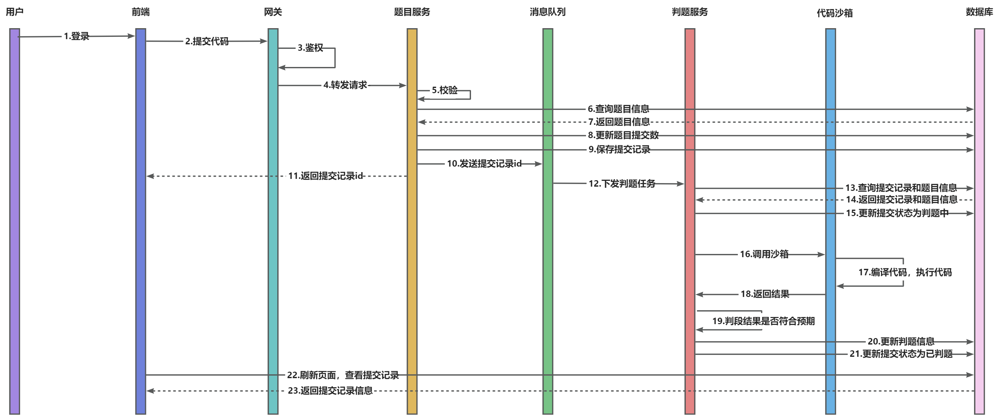


## 🚀快速启动 

### 前端

环境要求：Node.js >= 16

安装依赖：

```bash
yarn or  npm install
```

启动：

```bash
vue-cli-service serve
```

部署：

```bash
vue-cli-service build
```

### 后端

#### 环境准备

- **MySQL**

  执行 luooj-backend-microservice 项目 sql 目录下 create_table.sql

- **Redis**

- **Nacos（2.2.0）**

- **RabbitMQ**


## 📚 技术栈 

### **后端**

- Spring Boot 2.7.0
- Spring MVC
- MySQL 数据库
- 腾讯云COS存储
- Dubbo 分布式（RPC、Nacos）
- Spring Cloud Gateway 微服务网关
- RabbitMQ消息队列
- Docker
- Swagger + Knife4j 接口文档
- Spring Session Redis 分布式登录
- Apache Commons Lang3 工具类
- MyBatis-Plus 及 MyBatis X 自动生成
- Hutool、Apache Common Utils、Gson 等工具库

### 前端

- Vue3

- Arco Design

- OpenAPI 前端代码生成

- ByteMD

- Monaco Editor

  

## ☁️功能介绍 

| **功能**                     | 游客 | **普通用户** | **管理员** |
| ---------------------------- | ---- | ------------ | ---------- |
| 搜索题目、浏览题目           | ✅    | ✅            | ✅          |
| 在线做题，在线运行，在线提交 | ❌    | ✅            | ✅          |
| 浏览提交记录                 | ❌    | ✅            | ✅          |
| 更新头像                     | ❌    | ✅            | ✅          |
| 用户管理                     | ❌    | ❌            | ✅          |
| 题目管理                     | ❌    | ❌            | ✅          |


## ✨功能展示 

### 主页

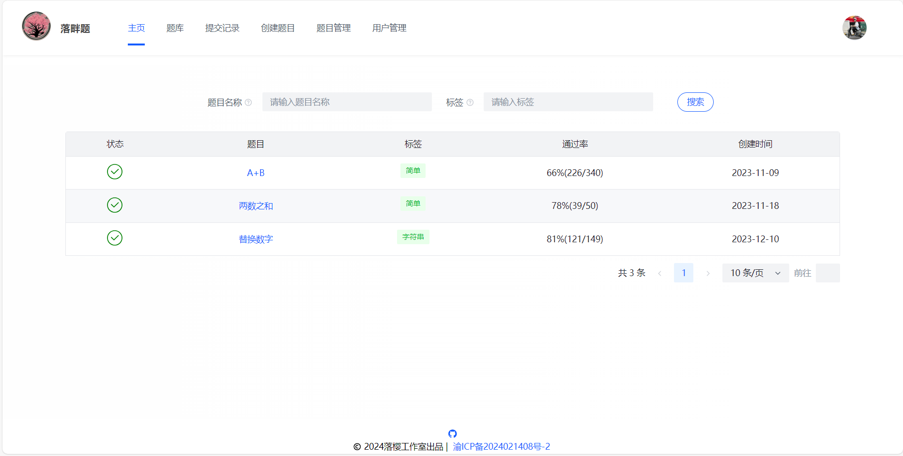


### 题库

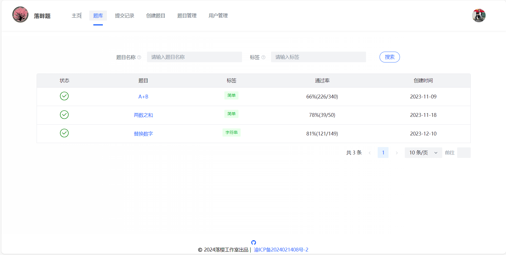


### 提交记录

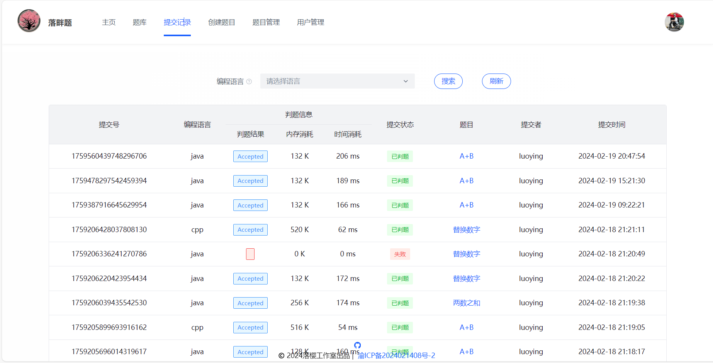

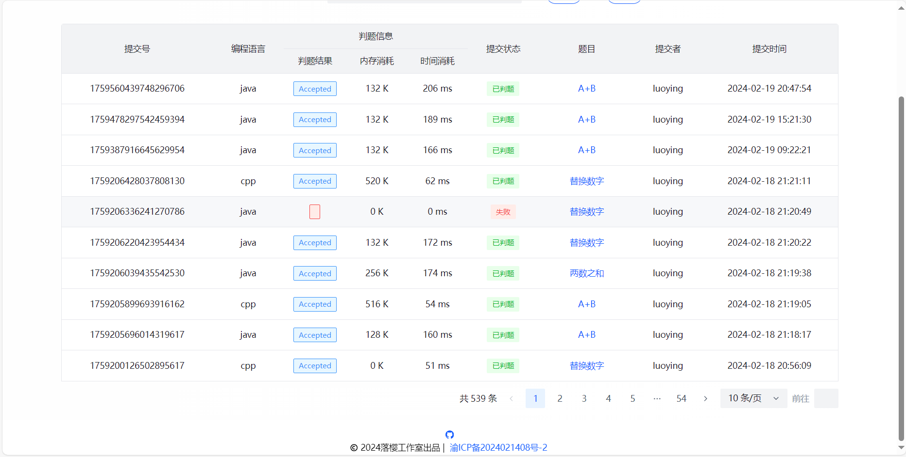


### 做题

#### 题目详情

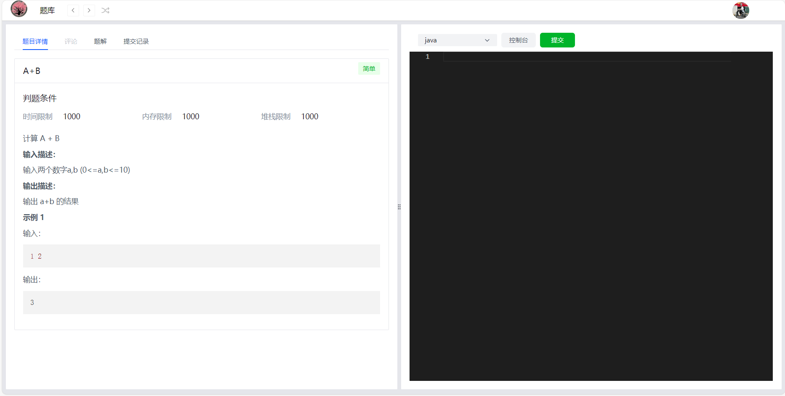

#### 题解

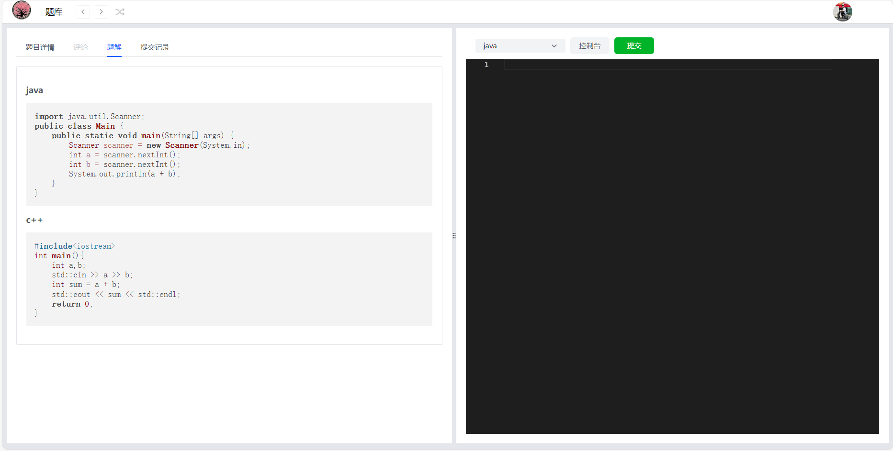


#### 个人提交记录

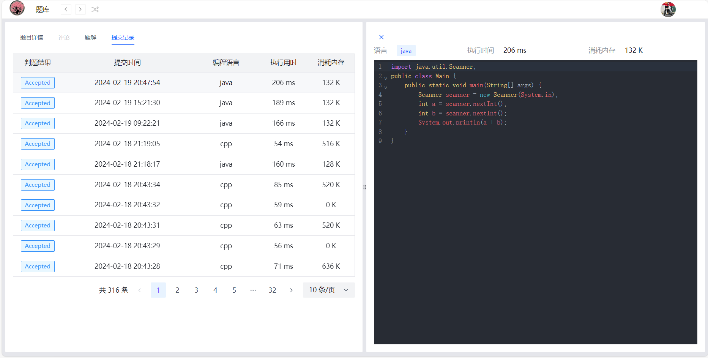


### 管理页

#### 用户管理

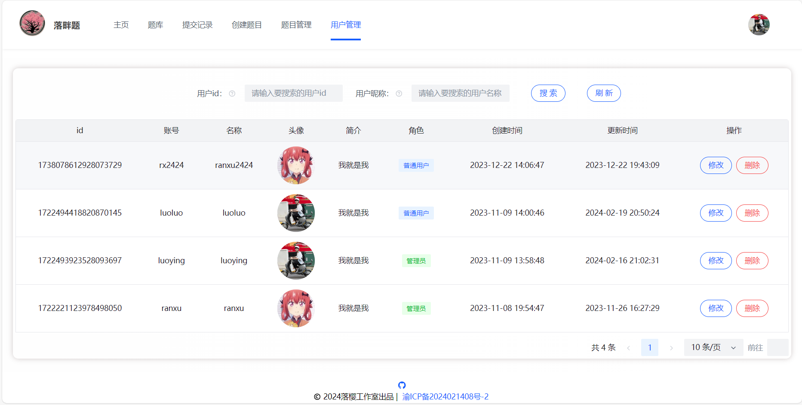

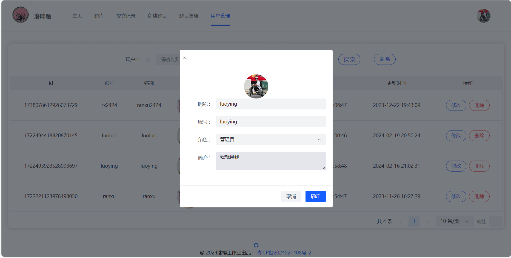


#### 题目管理

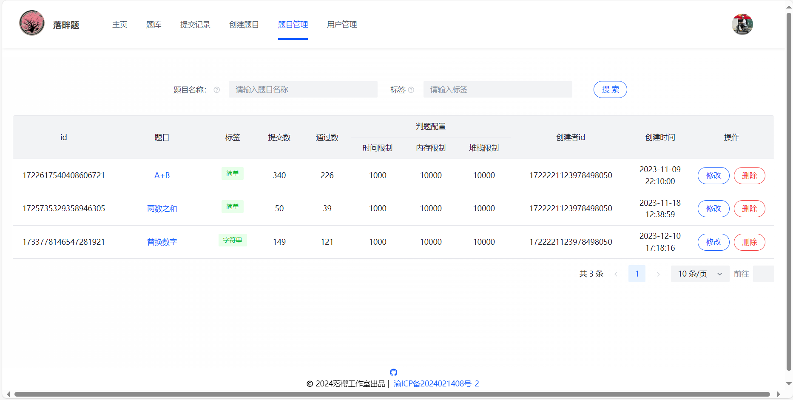

##### 创建题目

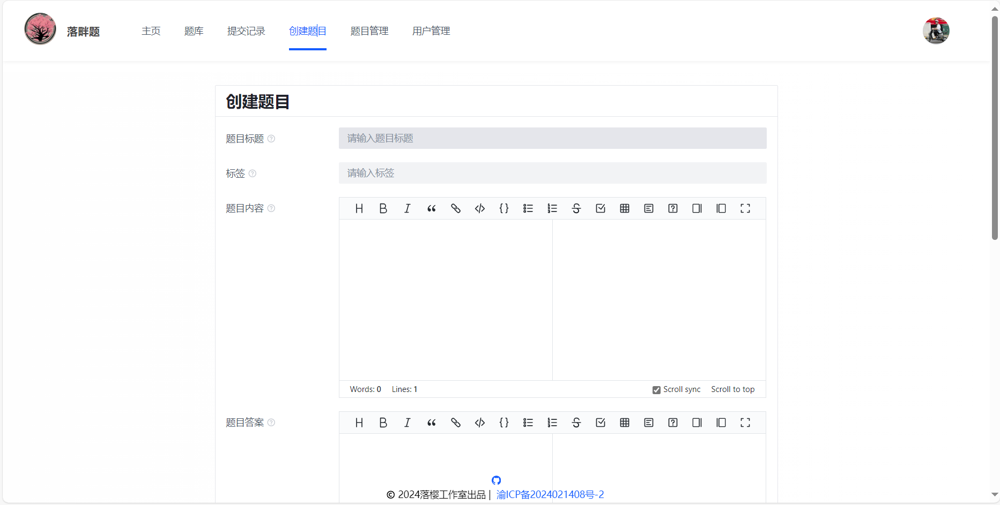

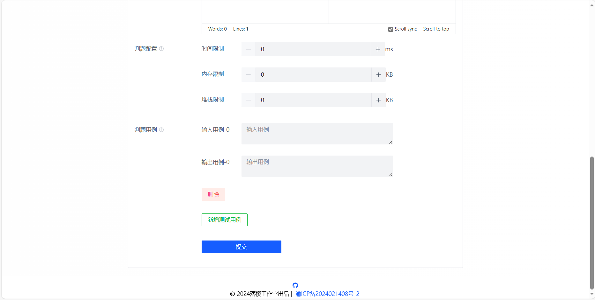


##### 修改题目

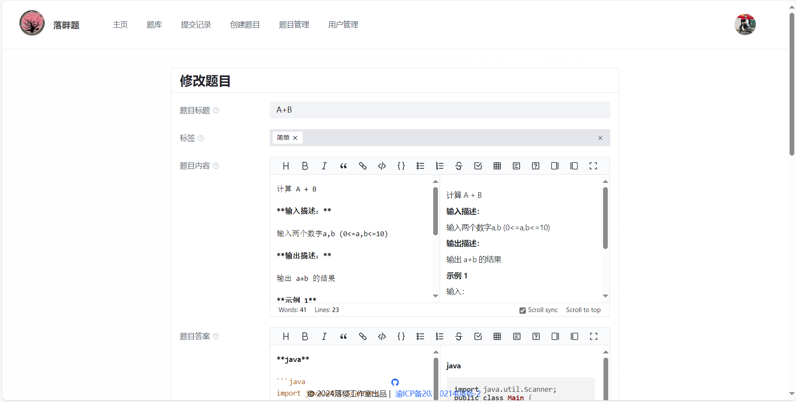

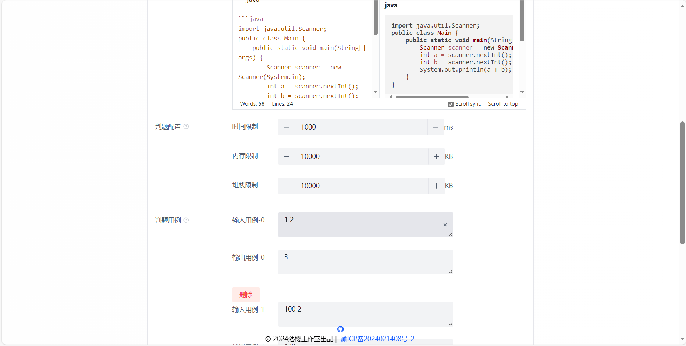

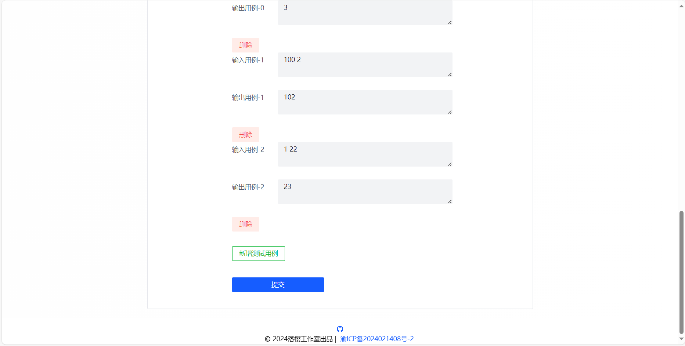


### 个人信息

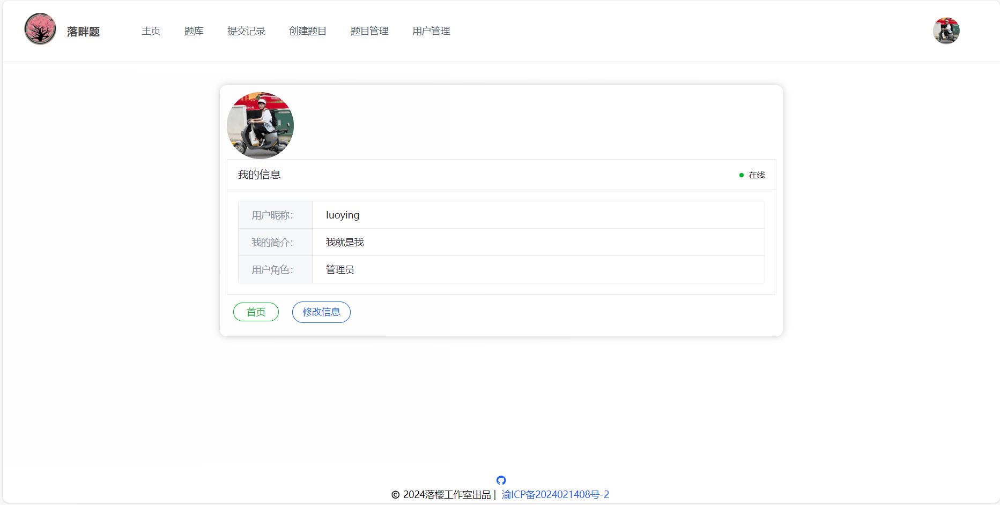


### 登录注册

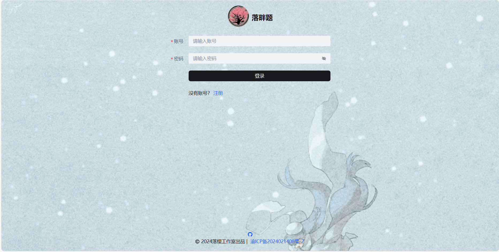

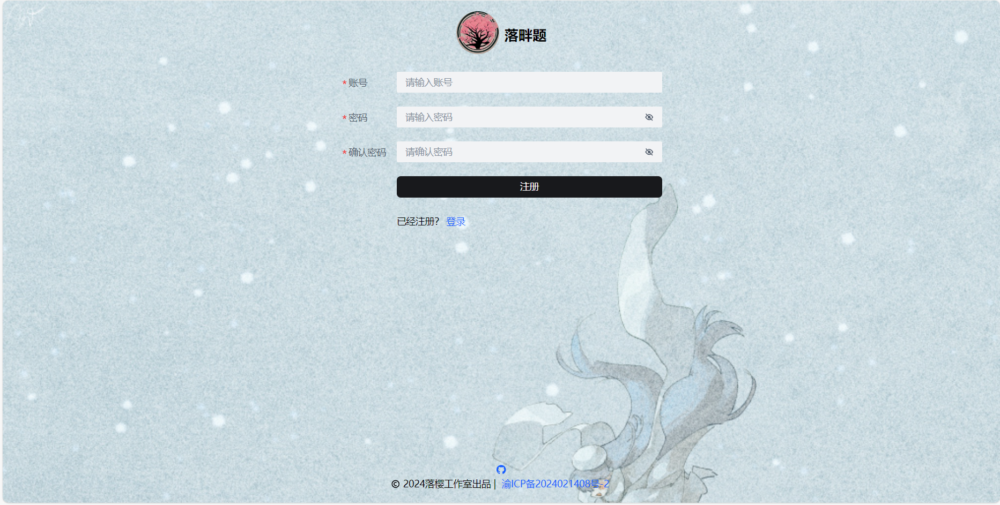